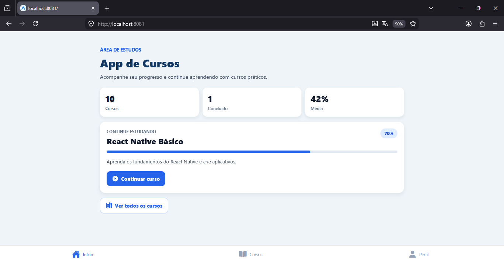
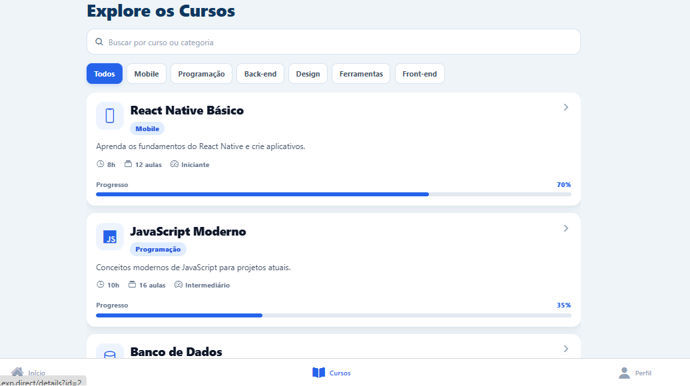
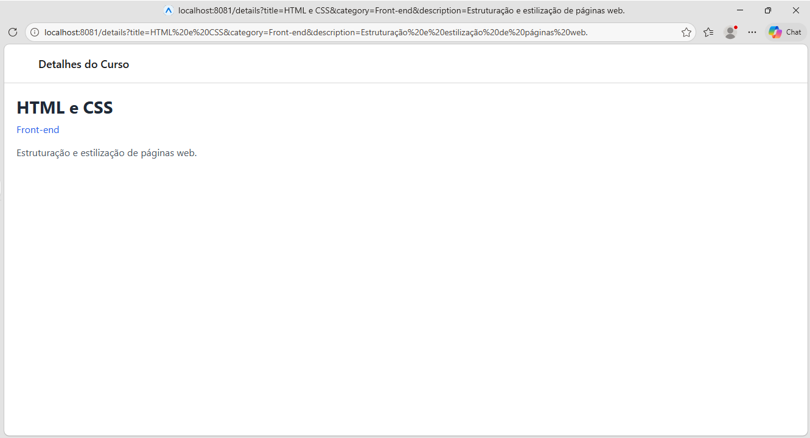

# App de Cursos

Aplicativo mobile desenvolvido com React Native e Expo para listar cursos, visualizar detalhes, acompanhar progresso e demonstrar uso de sensores do dispositivo.

## Funcionalidades

- Tela inicial com apresentacao do aplicativo e resumo de progresso.
- Tela de cursos com listagem usando `FlatList`.
- Busca por nome, descricao ou categoria do curso.
- Filtros por categoria.
- Cards de cursos com imagem, titulo, categoria, duracao, quantidade de aulas, nivel e progresso.
- Tela de detalhes com informacoes completas do curso selecionado.
- Passagem de parametros entre telas usando o `id` do curso.
- Tela de perfil com dados do aluno, progresso geral e estatisticas.
- Tela de sensores com camera e geolocalizacao.
- Explicacao dentro do app sobre camera, geolocalizacao e permissoes.
- Navegacao por abas entre Inicio, Cursos, Perfil e Sensores.
- Navegacao em pilha para a tela de detalhes.

## Sensores

O projeto usa dois recursos do dispositivo:

- Camera: exibida na tela Sensores com previa ao vivo e alternancia entre camera traseira e frontal.
- Geolocalizacao: solicita permissao e mostra latitude, longitude e precisao da localizacao atual.

As permissoes foram configuradas no `app.json` para Android e iOS.

## Tecnologias Utilizadas

- React Native
- Expo
- Expo Router
- TypeScript
- React Navigation
- Expo Vector Icons
- Expo Camera
- Expo Location

## Estrutura do Projeto

```text
app-de-cursos/
|-- app/
|   |-- (tabs)/
|   |   |-- _layout.tsx
|   |   |-- courses.tsx
|   |   |-- index.tsx
|   |   |-- profile.tsx
|   |   `-- sensors.tsx
|   |-- _layout.tsx
|   `-- details.tsx
|-- src/
|   |-- components/
|   |   |-- category-filter.tsx
|   |   |-- course-card.tsx
|   |   |-- progress-bar.tsx
|   |   `-- stat-card.tsx
|   |-- constants/
|   |-- data/
|   |-- hooks/
|   `-- types/
|-- assets/
|   |-- icons/
|   |-- images/
|   `-- screenshots/
|-- scripts/
|-- app.json
|-- package.json
|-- package-lock.json
|-- tsconfig.json
`-- README.md
```

## Telas do Aplicativo

- Inicio: mostra a apresentacao do app, resumo dos cursos e progresso geral.
- Cursos: exibe a lista de cursos disponiveis com busca e filtros.
- Detalhes: mostra informacoes completas do curso, modulos, progresso e acoes.
- Perfil: mostra dados do aluno, estatisticas e progresso de estudo.
- Sensores: demonstra camera, geolocalizacao e explica o papel de cada sensor.

## Como Instalar

```bash
npm install
```

## Como Executar

```bash
npx expo start
```

Depois de iniciar o Expo, escolha uma das opcoes exibidas no terminal:

- Pressione `w` para abrir no navegador.
- Pressione `a` para abrir no emulador Android.
- Escaneie o QR Code usando o aplicativo Expo Go.

## Criterios Atendidos

- Aplicativo funcional desenvolvido com React Native e Expo.
- Mais de 4 telas funcionais.
- Navegacao por abas.
- Navegacao em pilha para detalhes.
- Passagem de parametros entre telas.
- Telas e rotas separadas.
- Componentes reutilizaveis em `src/components`.
- Lista com `FlatList` e 10 cursos.
- Cards com imagem e texto.
- Tela de detalhes com informacoes completas.
- Tela de perfil do aluno.
- Uso de sensor de camera.
- Uso de sensor de geolocalizacao.
- Explicacao dos sensores dentro do app.
- Interface com icones, cores organizadas e layout responsivo.

## Screenshots

### Inicio



### Cursos



### Detalhes



### Perfil


## Desenvolvedora

Geovanna Santos de Almeida  
Matricula: 01815451
