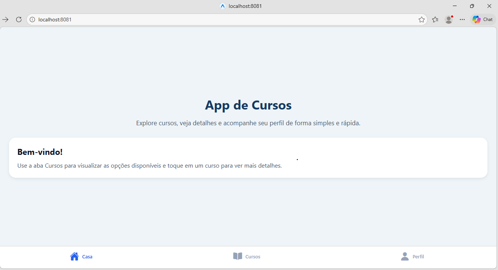
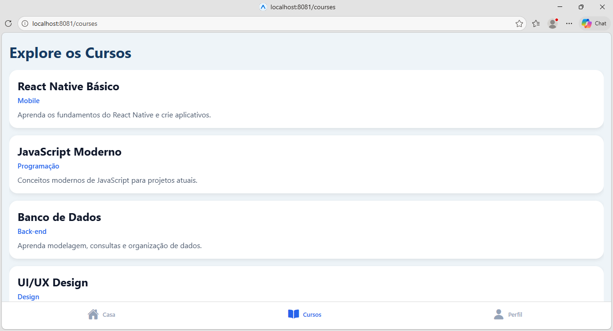
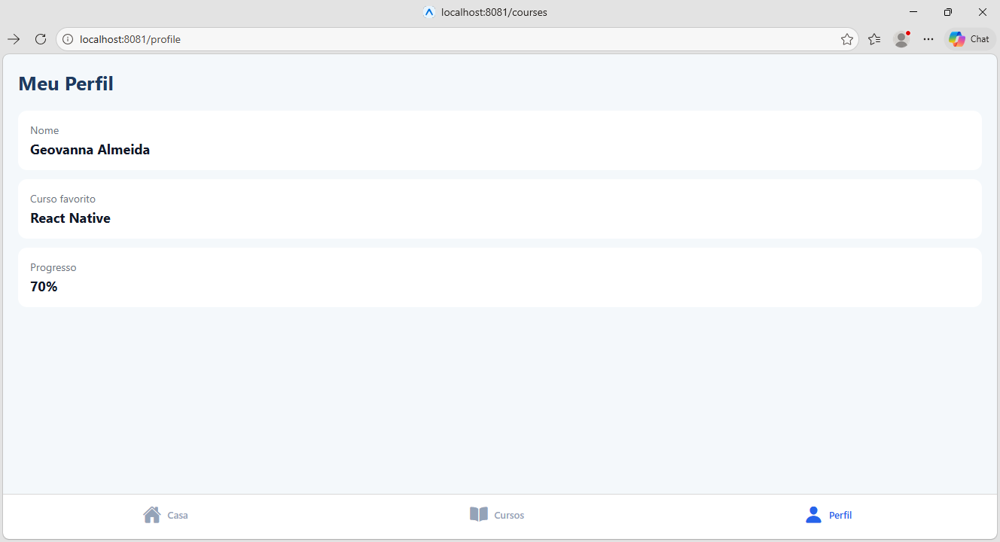

# App de Cursos

Este projeto é um aplicativo mobile desenvolvido com React Native utilizando Expo Router.

## Funcionalidades

- Tela inicial (Home)
- Listagem de cursos
- Navegação entre telas
- Tela de detalhes do curso
- Tela de perfil do usuário

## Tecnologias utilizadas

- React Native
- Expo
- Expo Router
- JavaScript / TypeScript

## Estrutura do Projeto

```text
mobile-code/
 ├── app/
 │   ├── (tabs)/
 │   │   ├── _layout.tsx
 │   │   ├── courses.tsx
 │   │   ├── index.tsx
 │   │   ├── profile.tsx
 │   │
 │   ├── data/
 │   │   └── courses.ts
 │   │
 │   ├── _layout.tsx
 │   ├── details.tsx
 │
 ├── assets/
 │   └── images/
 │       ├── home.png
 │       ├── cursos.png
 │       ├── perfil.png
 │       ├── detalhes.png
 │       ├── icon.png
 │       ├── favicon.png
 │       └── splash-icon.png
 │
 ├── components/
 ├── constants/
 ├── hooks/
 ├── scripts/
 │
 ├── .gitignore
 ├── app.json
 ├── eslint.config.js
 ├── package.json
 ├── package-lock.json
 ├── tsconfig.json
 └── README.md

## Telas do aplicativo

- Home
- Cursos
- Detalhes
- Perfil

## Como executar o projeto

1. Clone o repositório:
git clone https://github.com/geoalmeiida/app-de-cursos.git

2. Acesse a pasta:
cd app-de-cursos

3. Instale as dependências:
npm install

4. Execute o projeto:
npx expo start

## Screenshots

### Home


### Cursos


### Perfil


### Detalhes


## Desenvolvido por

Aluna: Geovanna Santos de Almeida
Matrícula: 01815451


   
   
